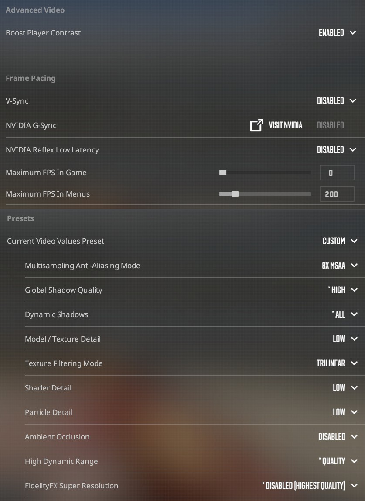

# Autoexec of Gamix

## Steps to apply settings

1. Delete all files in your userdata steam folder

```markdown
<STEAM_INSTALL_FOLDER>\userdata\<YOUR_STEAM32_ID>\730\local\cfg
```

2. Add "autoexec.cfg" to your counterstrike folder

```markdown
<STEAM_INSTALL_FOLDER>\steamapps\common\Counter-Strike Global Offensive\game\csgo\cfg
```

3. Add following line in the launch options of counterstrike

```sh
+exec autoexec.cfg
```

4. Change following advanced video settings inside counterstrike

```
Fullscreen 1920x1080 240hz
```



5. (optional) Restart game
